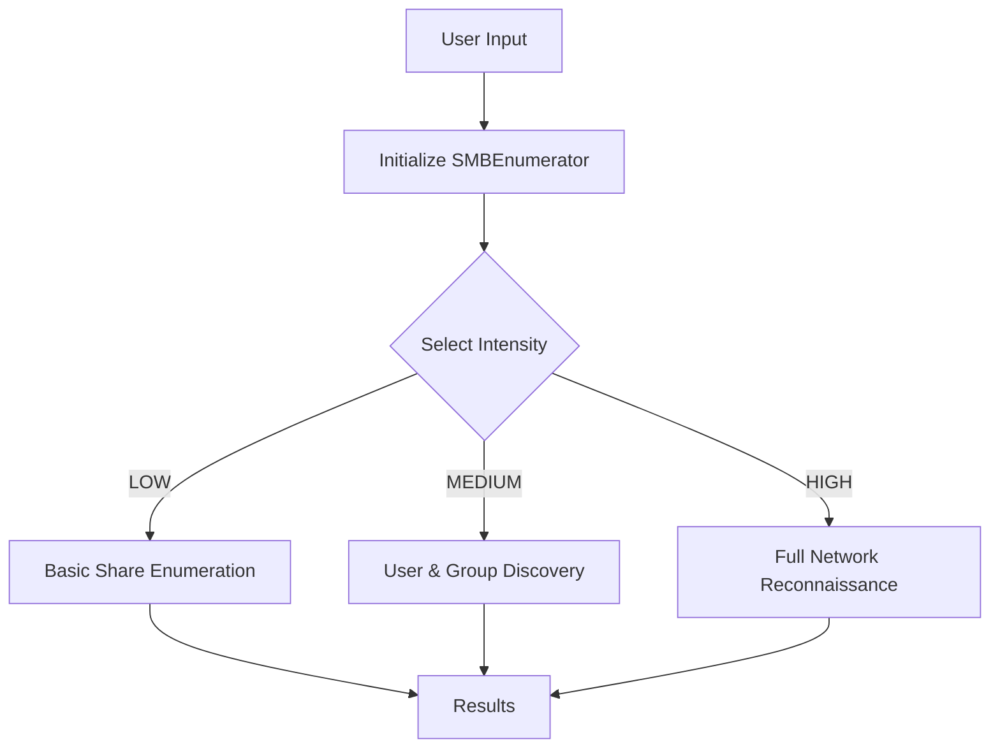

# 🔍 Impaktor Tools - SMB Enumeration Suite

<div align="center">
  
  
  
</div>

<p align="center">
  
</p>

---

## 📋 Table of Contents

- [🌟 Overview](#-overview)
- [✨ Features](#-features)
- [🚀 Installation](#-installation)
- [🎮 Usage Guide](#-usage-guide)
- [🛠️ How It Works](#️-how-it-works)
- [🔐 Security Notice](#-security-notice)
- [📊 Enumeration Levels](#-enumeration-levels)
- [🧰 Advanced Usage](#-advanced-usage)
- [🤝 Contributing](#-contributing)
- [📜 License](#-license)

---

## 🌟 Overview

**Impaktor Tools** is a powerful SMB enumeration suite designed for network administrators and security professionals. This Python-based tool leverages the Impacket library to conduct comprehensive SMB reconnaissance on Windows networks, helping identify potential vulnerabilities and misconfigurations.

> 💡 **Pro Tip**: SMB enumeration is a critical first step in understanding your network's attack surface.

<p align="center">
  
</p>

---

## ✨ Features

| Feature | Description |
|---------|-------------|
| 🔌 **Multi-Protocol Support** | Works with SMBv1, SMBv2, and SMBv3 |
| 🔍 **Tiered Enumeration** | Three intensity levels to match your reconnaissance needs |
| 🛡️ **Integrated Authentication** | Support for domain, local, and null authentication |
| 📊 **Detailed Reporting** | Comprehensive output of discovered network resources |
| 📂 **Share Analysis** | Identifies readable and writable network shares |
| 👥 **User Enumeration** | Lists domain users, groups, and sessions |
| 🔄 **Service Discovery** | Enumerates running services on target systems |
| 📱 **Cross-Platform** | Runs on Linux, macOS, and Windows |

---

## 🚀 Installation

### Prerequisites
- Python 3.8 or higher
- pip package manager
- Network access to target systems

### Setup

```bash
# Clone the repository
git clone https://github.com/user/Impaktor_Tools.git
cd Impaktor_Tools

# Create a virtual environment
python -m venv venv
source venv/bin/activate  # On Windows: venv\Scripts\activate

# Install dependencies
pip install -r requirements.txt
```

💾 **Required Dependencies**:
- impacket>=0.10.0
- colorama>=0.4.4
- tqdm>=4.64.0
- cryptography>=38.0.0

---

## 🎮 Usage Guide

### Basic Usage

```bash
python main.py
```

Follow the interactive prompts to input:
1. Target IP or hostname
2. Username (leave blank for null session)
3. Password (securely hidden during input)
4. Domain name (e.g., WORKGROUP)
5. Enumeration intensity level

### Command-Line Arguments

For automation and scripting, you can pass arguments directly:

```bash
python main.py --target 192.168.1.100 --username admin --password P@ssw0rd --domain CORP --level HIGH
```

<details>
<summary>📋 Click to view all command-line options</summary>

```
Options:
  --target TEXT     Target IP address or hostname
  --username TEXT   Username for authentication
  --password TEXT   Password for authentication
  --domain TEXT     Domain name (default: WORKGROUP)
  --level TEXT      Enumeration intensity: LOW, MEDIUM, HIGH
  --output TEXT     Output file for results
  --timeout INT     Connection timeout in seconds
  --no-color        Disable colored output
  --debug           Enable debug logging
  --help            Show this help message
```
</details>

---

## 🛠️ How It Works

The core functionality is powered by the `SMBEnumerator` class, which manages connections and performs reconnaissance based on user-selected intensity levels:



### Inside the Code

The main Python script orchestrates several key components:

1. **IntensityLevel Enum**: Defines enumeration depth categories
   ```python
   class IntensityLevel(Enum):
       LOW = 1      # Basic share enumeration
       MEDIUM = 2   # Users, groups, and shares
       HIGH = 3     # Everything + services, sessions, policies
   ```

2. **SMBEnumerator Class**: Handles connection logic and enumeration methods
   ```python
   class SMBEnumerator:
       def __init__(self, target, username, password, domain):
           self.target = target
           self.username = username
           self.password = password
           self.domain = domain
           self.connection = None
           
       def connect(self):
           # Establishes SMB connection
           
       def enumerate_low(self):
           # Basic enumeration logic
           
       # Additional methods for higher intensity levels
   ```

3. **UserInputHandler Class**: Manages CLI interaction
   ```python
   class UserInputHandler:
       @staticmethod
       def get_target():
           # Prompts for target information
           
       # Additional input methods
   ```

---

## 🔐 Security Notice

> ⚠️ **Important**: This tool is designed for legitimate security assessment and system administration purposes. Unauthorized scanning of networks may violate legal regulations and organizational policies.

Always ensure you have proper authorization before running SMB enumeration against any system. The tool requires authentication credentials that should be handled securely.

<p align="center">
  
</p>

---

## 📊 Enumeration Levels

### 🟢 LOW Intensity
- Lists available SMB shares
- Identifies server version
- Minimal network footprint
- Ideal for initial reconnaissance

<details>
<summary>Example Output</summary>

```
[+] Connected to 192.168.1.100
[+] Server OS: Windows Server 2019 Standard
[+] Server Domain: WORKGROUP

[+] Shares found:
  - ADMIN$ (Remote Admin)
  - C$ (Default share)
  - IPC$ (Remote IPC)
  - Public (Data share)
```
</details>

### 🟡 MEDIUM Intensity
- Everything in LOW level
- Enumerates users and groups
- Lists accessible shares with permissions
- Identifies logged-on users

<details>
<summary>Example Output</summary>

```
[+] Domain Users:
  - Administrator (RID: 500)
  - Guest (RID: 501)
  - krbtgt (RID: 502)
  - john.doe (RID: 1001)

[+] Domain Groups:
  - Domain Admins
  - Domain Users
  - Domain Computers

[+] Share Access:
  - ADMIN$ - No access
  - C$ - No access
  - IPC$ - READ
  - Public - READ/WRITE
```
</details>

### 🔴 HIGH Intensity
- Everything in MEDIUM level
- Enumerates running services
- Checks for security vulnerabilities
- Analyzes password policies
- Identifies all network sessions

<details>
<summary>Example Output</summary>

```
[+] Active Sessions:
  - ADMIN (192.168.1.5) - Connected since 2023-04-09 14:32:41

[+] Running Services:
  - spoolsv.exe (Print Spooler)
  - lsass.exe (Security Service)
  - sqlservr.exe (SQL Server)

[+] Password Policy:
  - Minimum Length: 8 characters
  - Lockout Threshold: 5 attempts
  - Lockout Duration: 30 minutes

[+] Potential Vulnerabilities:
  - MS17-010 (EternalBlue) - NOT VULNERABLE
  - CVE-2020-1472 (Zerologon) - POTENTIALLY VULNERABLE
```
</details>

---

## 🧰 Advanced Usage

### Automation & Scripting

Integrate Impaktor Tools into your security automation pipelines:

```python
from impaktor_tools import SMBEnumerator, IntensityLevel

def scan_network_segment(network_prefix):
    results = {}
    for i in range(1, 255):
        target = f"{network_prefix}.{i}"
        try:
            enumerator = SMBEnumerator(target, "username", "password", "DOMAIN")
            enumerator.connect()
            results[target] = enumerator.enumerate_medium()
        except Exception as e:
            results[target] = f"Error: {str(e)}"
    return results

# Scan an entire subnet
results = scan_network_segment("192.168.1")
```

### Custom Output Formatting

The tool supports various output formats:

```bash
# JSON output
python main.py --target 192.168.1.100 --output results.json --format json

# CSV output
python main.py --target 192.168.1.100 --output results.csv --format csv

# HTML report
python main.py --target 192.168.1.100 --output report.html --format html
```

---

## 🤝 Contributing

We welcome contributions to improve Impaktor Tools! Here's how you can help:

1. **Fork the repository**
2. **Create a feature branch**:
   ```bash
   git checkout -b feature/awesome-enhancement
   ```
3. **Make your changes** and add tests if applicable
4. **Run the existing tests**:
   ```bash
   pytest tests/
   ```
5. **Submit a pull request**

Please read our [Contributing Guidelines](CONTRIBUTING.md) for more details.

### Development Setup

```bash
# Install development dependencies
pip install -r requirements-dev.txt

# Run linting
flake8 impaktor_tools

# Run type checking
mypy impaktor_tools
```

---

## 📜 License

This project is licensed under the MIT License - see the [LICENSE](LICENSE) file for details.

```
MIT License

Copyright (c) 2023 Impaktor Tools Contributors

Permission is hereby granted, free of charge, to any person obtaining a copy
of this software and associated documentation files...
```

---

<p align="center">
  <a href="https://github.com/user/Impaktor_Tools/stargazers">
    
  </a>
  <a href="https://github.com/user/Impaktor_Tools/network/members">
    
  </a>
</p>

<p align="center">
  
</p>

<p align="center">
  <i>Made with ❤️ for the security community</i>
</p>

<p align="center">
  <a href="https://www.buymeacoffee.com/impaktoruser">
    
  </a>
</p>
